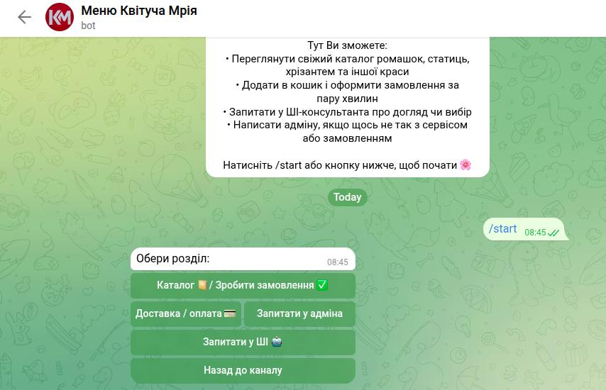
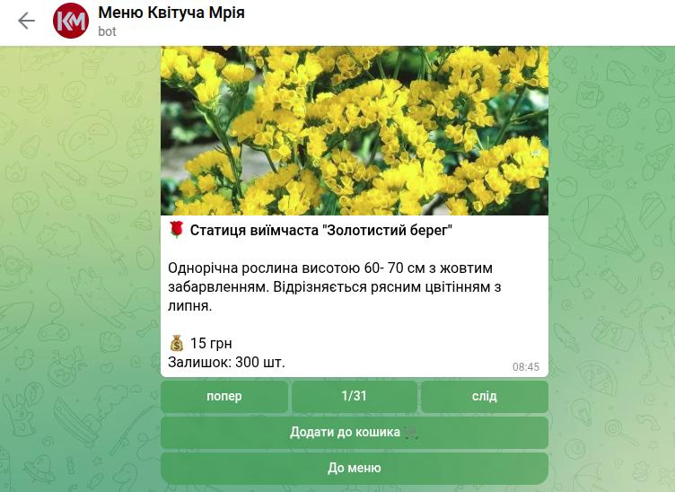
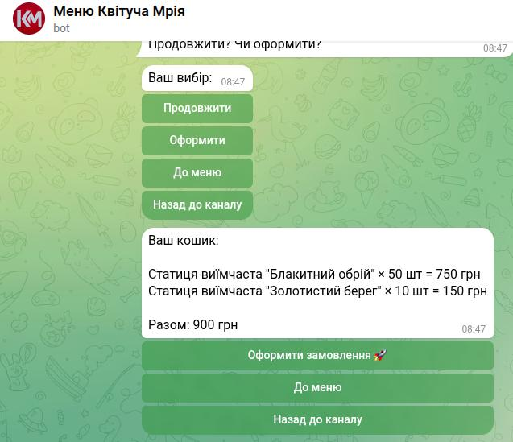
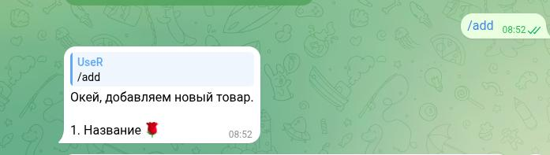
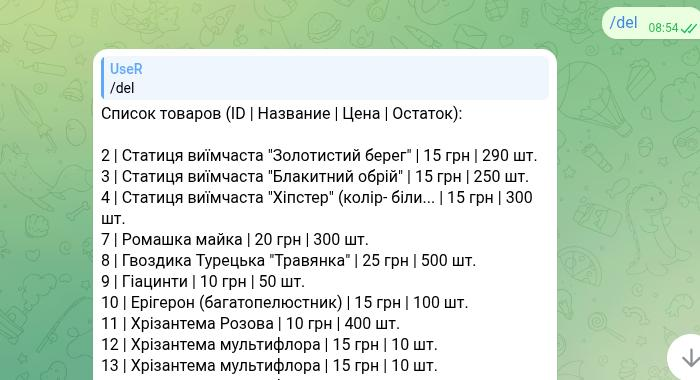
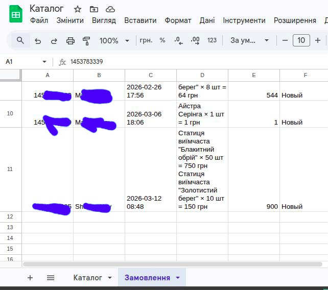

# Telegram Flower Shop Bot

Бот-магазин для продажи рассады и цветов 🌹  
Полноценный функционал: карусель товаров, корзина, оформление заказа, админ-панель для добавления/удаления товаров.

## Фичи
- Карусель товаров с фото, ценой, описанием и остатком (из Google Sheets)
- Добавление в корзину с выбором количества
- Корзина + оформление заказа (сохранение в Google Sheet + уведомление админу)
- Автоматическое уменьшение остатка при заказе
- Админ-команды: /add, /delete, /reload_catalog
- Проверка админов по ID

## Технологии
- Python 3.10+
- pyTelegramBotAPI (telebot)
- gspread + Google Service Account
- Google Sheets как база товаров и заказов

## Установка (для локального запуска)
1. Склонируй репозиторий
2. `pip install -r requirements.txt`
3. Создай `.env` в корне:
   BOT_TOKEN=твой_токен_от_BotFather
    SPREADSHEET_ID=твой_id_таблицы
    ADMIN_IDS=123456789,987654321
4. Положи credentials.json (Google Service Account) в корень
5. `python main_bot.py`

## Скриншоты

### Главное меню

### Карусель товаров

### Корзина

### Оповещение админу

### Админ-панель (/add)

### Админ-панель (/del)

### Таблица заказов в Google Sheets

## Лицензия
MIT — делай что хочешь, но оставь мой ник в копипасте
